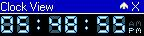



## DM Bitblt Clock Example

### Description

Hi This is just a simple little example of a Clock Yes a Clock you all seen them before anyway felt a little board so made this uses Bitblt to skin a clock on a form. I think this be good for beginners as thay learn how to use some basic API calling and how to use Bitblt and other things anyway hope someone find a use for it O also you can change the view to show the date and fold up the form please vote.
 
### More Info
 

             |
---                |---
**Submitted On**   |2003-03-16 00:26:02
**By**             |[dreamvb](https://github.com/Planet-Source-Code/PSCIndex/blob/master/ByAuthor/dreamvb.md)
**Level**          |Beginner
**User Rating**    |4.9 (34 globes from 7 users)
**Compatibility**  |VB 3\.0, VB 4\.0 \(16\-bit\), VB 4\.0 \(32\-bit\), VB 5\.0, VB 6\.0
**Category**       |[Miscellaneous](https://github.com/Planet-Source-Code/PSCIndex/blob/master/ByCategory/miscellaneous__1-1.md)
**World**          |[Visual Basic](https://github.com/Planet-Source-Code/PSCIndex/blob/master/ByWorld/visual-basic.md)
**Archive File**   |[DM\_Bitblt\_1560553162003\.zip](https://github.com/Planet-Source-Code/dreamvb-dm-bitblt-clock-example__1-44060/archive/master.zip)

